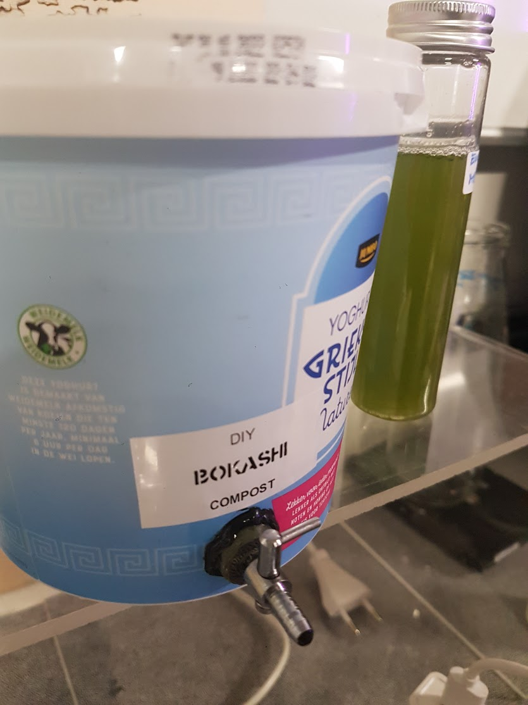
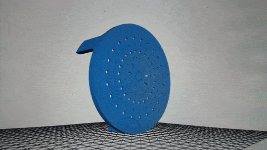
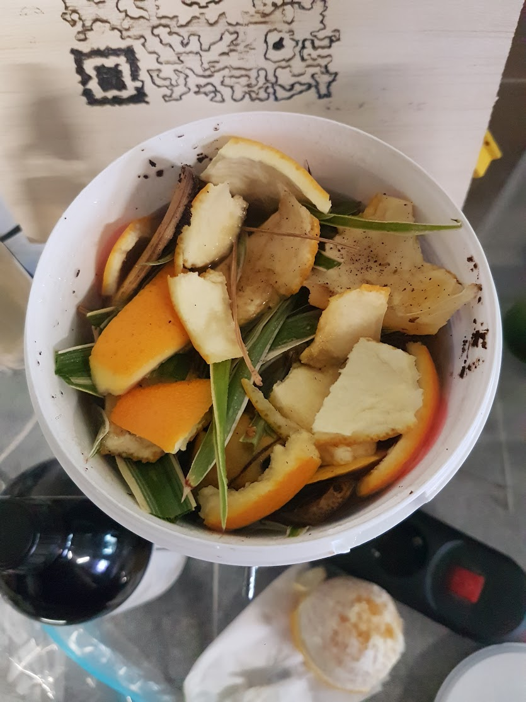
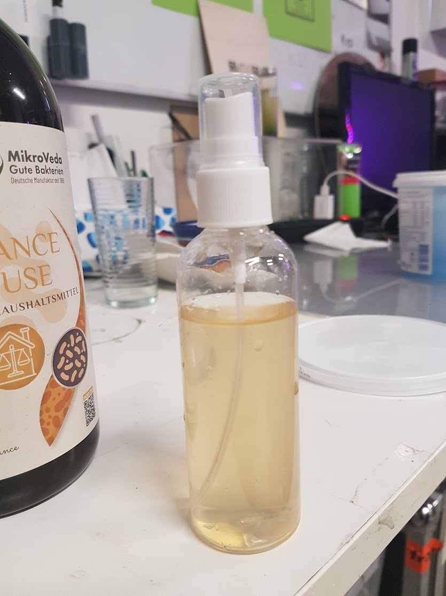
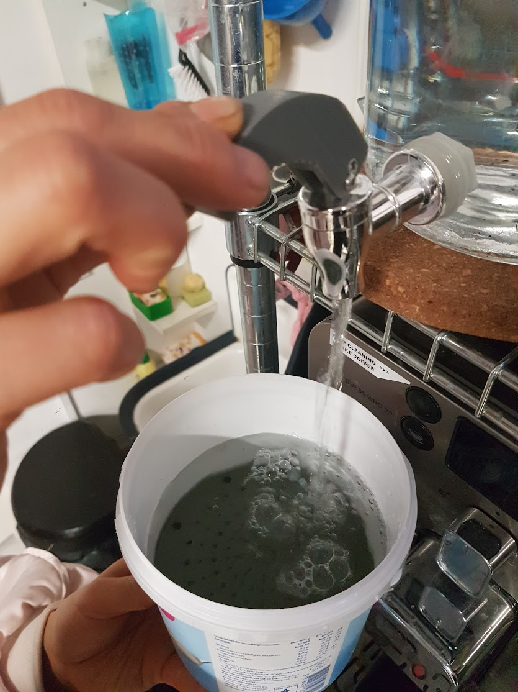
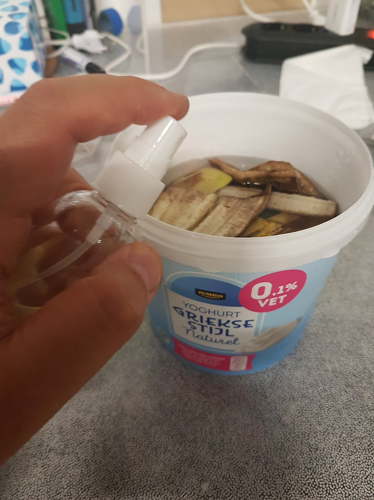

**BOKASHI - DIY home composting and fertilizer**

<tr>
<td align = "center" width = 50% >

</tr>
  
Bokashi is a fermentative decomposition process that originates from Japan and involves the breakdown of organic matter, such as food waste.
In traditional composting processes, organic matter rots to release emissions and creates a horrible smell. 
Through Bokashi fermentation, the energy within food waste is retained resulting in a sweet smelling, nutrient dense and microbially rich soil improver that works wonders in the garden and is kind to the environment.
  

The presence of effective microorganisms (EM) within the compost can help to suppress harmful bacteria, fungi and viruses present in soils, as well as adding nutrients such as vitamins and organic acids into the ground which are readily available for plants to take up and help to encourage healthy plant growth.
  
By using Bokashi, we can help to reduce the amount of food waste being sent to landfill, and the negative impact of this, from the comfort of our own homes simply by producing a nutrient rich compost using our food waste. 

<!------- TR -------->
<tr>
<td align = "center" width = 50% >

</tr>

We have designed a 3D-printed filter that adapts to a most common 1Kg Yoghurt bucket to fully match our practical rec/rep philosophy (recycle/repurpose). The filter sits at the bottom of the bin so that the elements decomposed from the organic waste in the upper side can be dissolved in the water and collected via a small tap. 

<!------- TR -------->
<tr>
<td align = "center" width = 50% >

<td align = "center" width = 50% >

</tr>

Literally ANY kind of home produced organic food waste can be added to the mix in the bin. The more diverse, the better. 
  
E.M. (Effective Microorganisms) should be added to the organic compost so to prevent harmful molds and bacteria to spread over the compost and release a nasty smell.
 
E.M. can be bought at organic farming shops at fair prices or (better) easily produced at home through rice fermentation process. We'll document this process soon too, meanwhile you can check this tutorial for DIY'ing EM.

<!------- TR -------->
<tr>
<td align = "center" width = 50% >

<td align = "center" width = 50% >

</tr>
<!-------  BACK   --------->

[ <a href="../README.md#readme-top"> back</a> ]

