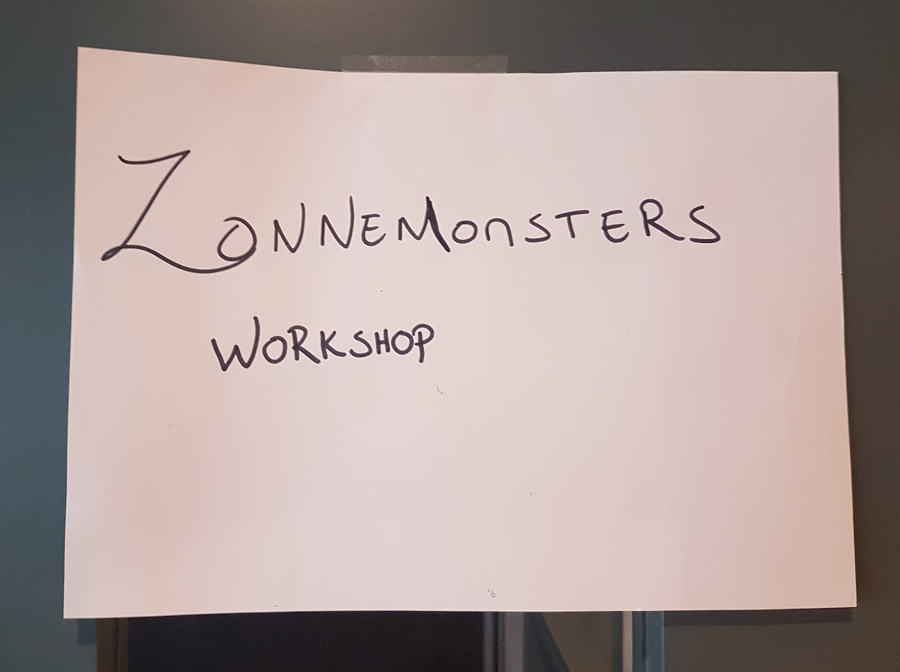
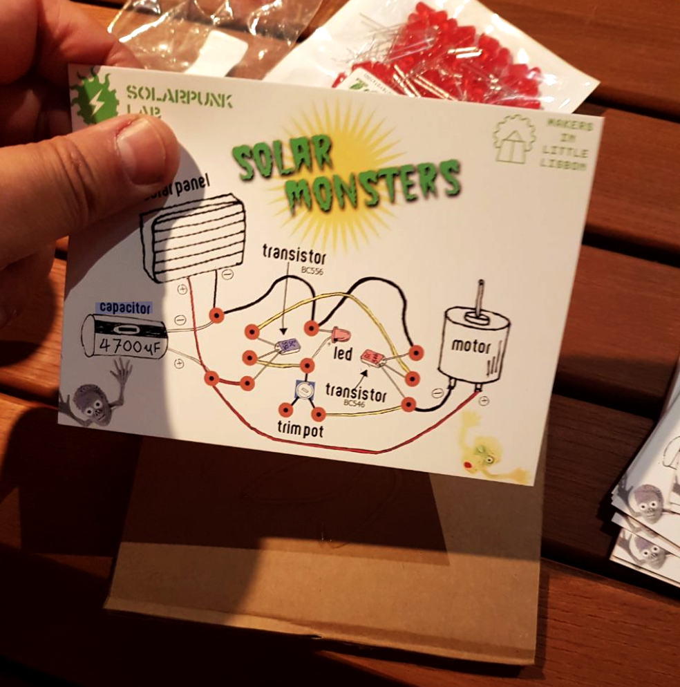
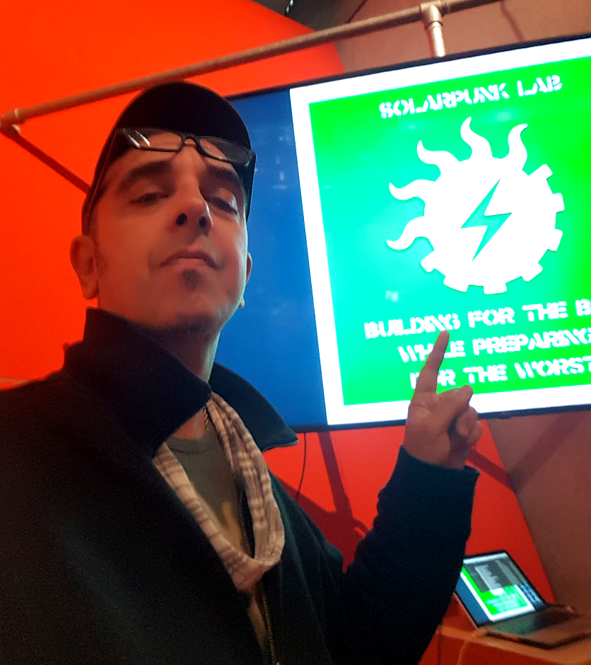
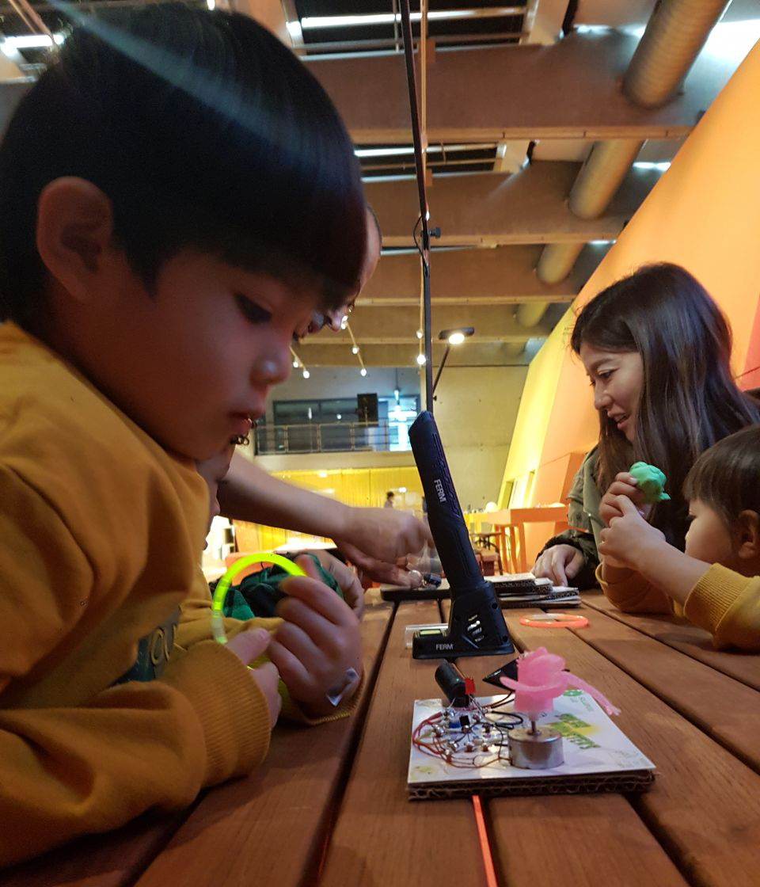
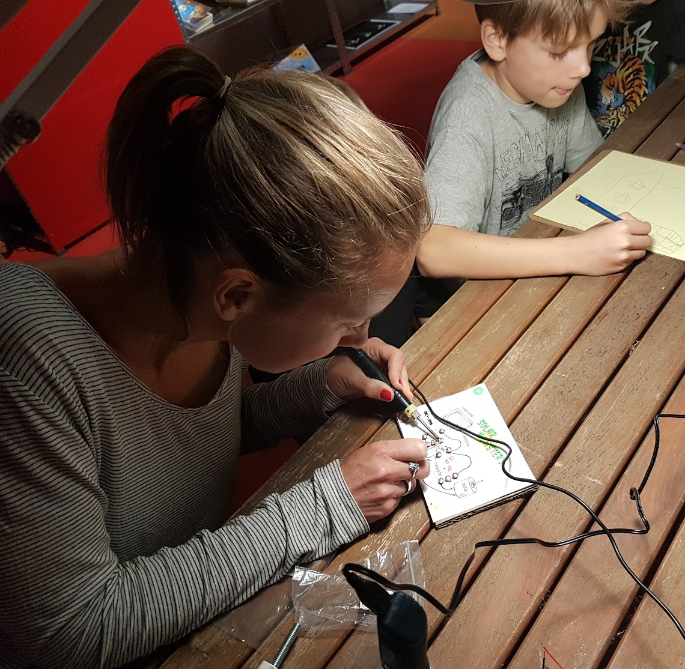
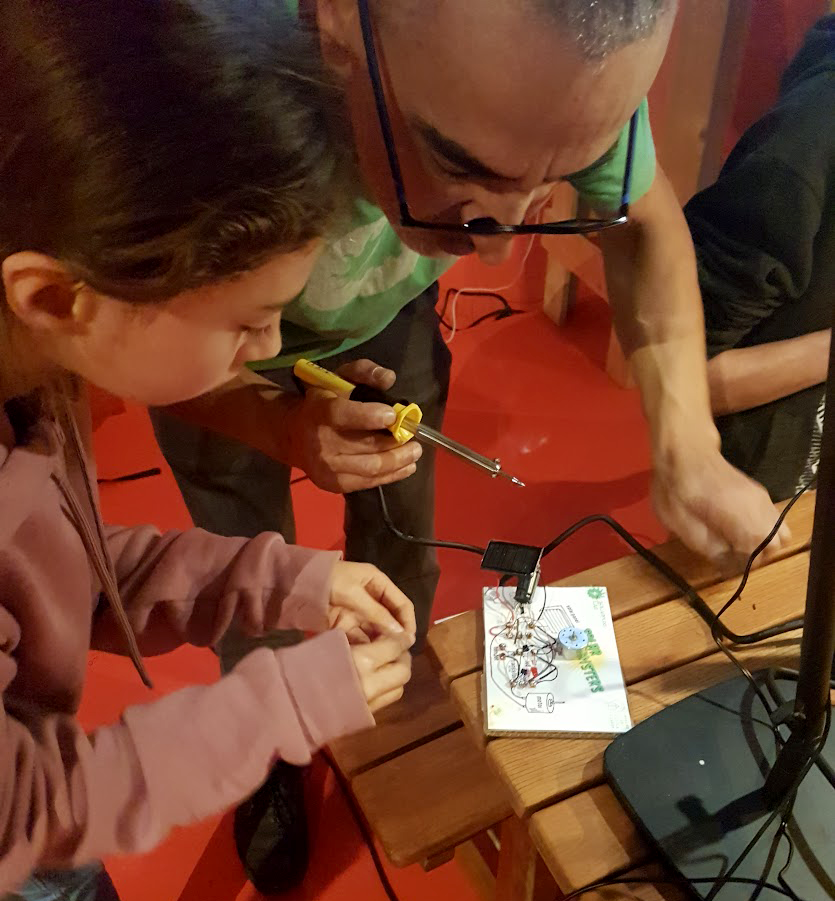
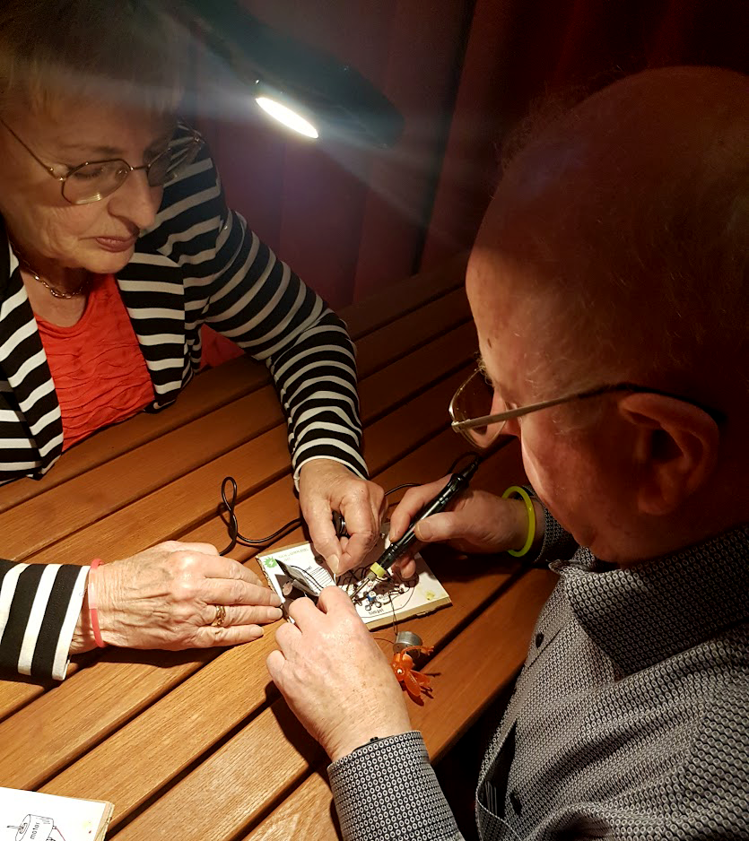

**SOLAR MONSTERS WORKSHOPS @ HNI**

<!-------  BACK   --------->

[ <a href="../README.md#readme-top"> back</a> ]

<table width = 90%>
<tr>
<td align = "justify" width = 90% colspan=2>
Solarpunk Lab was invited to conduct the "SOLAR MONSTERS" workshop at <a href="https://hetnieuweinstituut.nl/" target="new">HET NIEUWE INSTITUUT</a> in Rotterdam, as part of the SOLAR BIENNALE and "The Energy Show" exhibition.  This full-day, all-ages, hands-on workshop was held by TeZ in collaboration with Mauricio Martins of <a href="https://mill.pt/" target="new">MILL (Makers In Little Lisbon)</a> Portuguese makerspace.
  
</tr>

<tr>
<td align = "justify" width = 90% colspan=2>

 

 

 

 

 

 

 

 

</tr>

</table>
 
 <!-------  BACK   --------->

[ <a href="../README.md#readme-top"> back</a> ]
