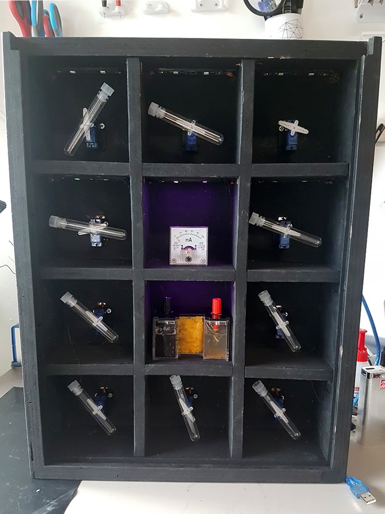

**MICROBIAL FUEL CELL / BIOREACTOR**

<!-------  BACK   --------->

[ <a href="../README.md#readme-top"> back</a> ]

<table width = 90%>
<tr>
<td align = "justify" width = 90% colspan=2>
A microbial fuel cell, or <a href="https://www.youtube.com/watch?v=q_TVddg1NFs" target="new">MFC</a>, is a fuel cell in which the naturally occurring electrochemical processes of anaerobic bacteria breaking down food, are harnessed to generate electricity.
  
We are attempting to build a acombined autonomous system that can host a MFC and a Bioreactor with a set of test tube shakers, holding microorganisms at ideal conditions of temperature, humidity and luminosity.
  
This is very much an "in-progress" project and aimed more at a "demo" and testing bench, inspiring future builds other than being a truly effective system itself.
  

  

</td>
</tr>

</table>

 <!-------  BACK   --------->

[ <a href="../README.md#readme-top"> back</a> ]

