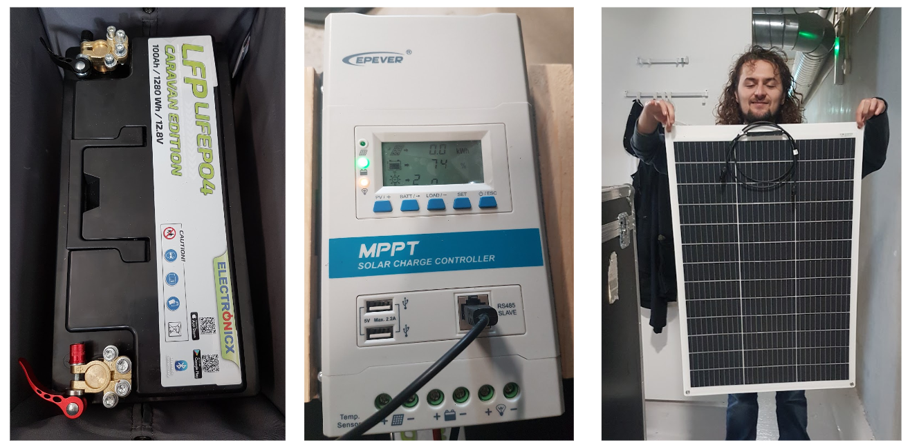
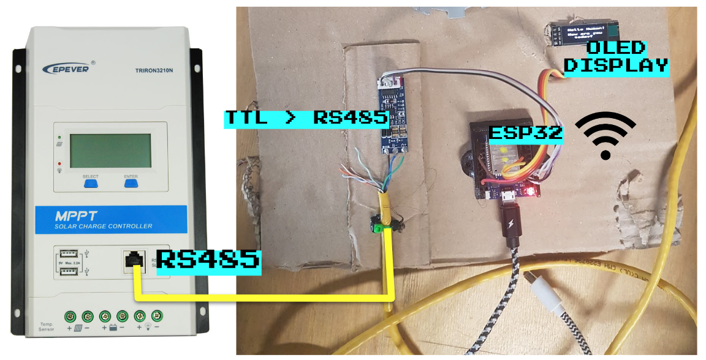
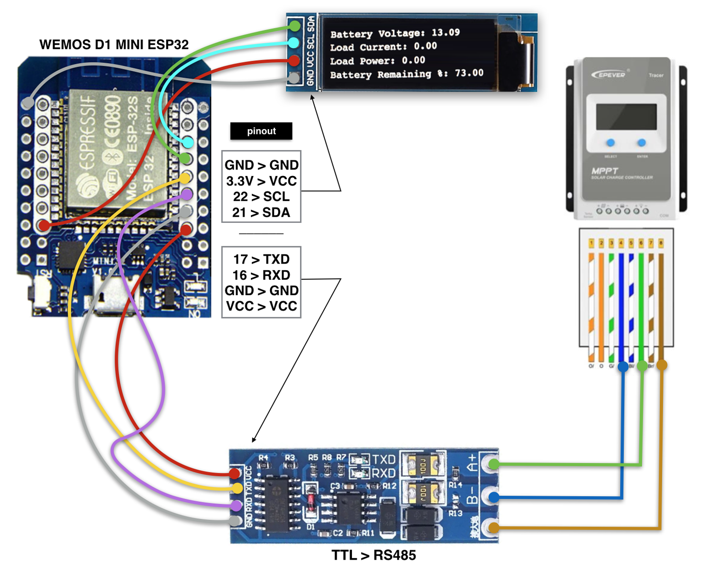
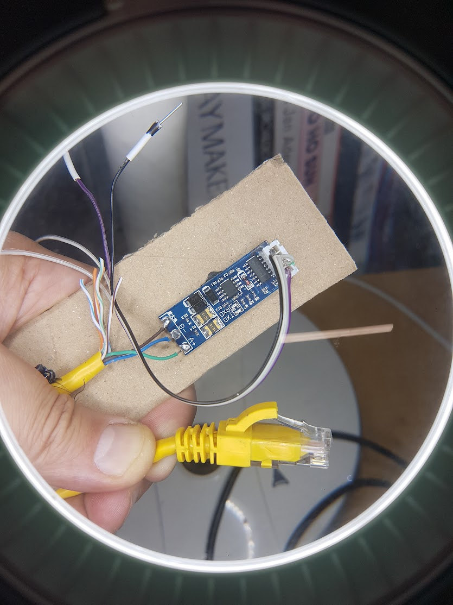
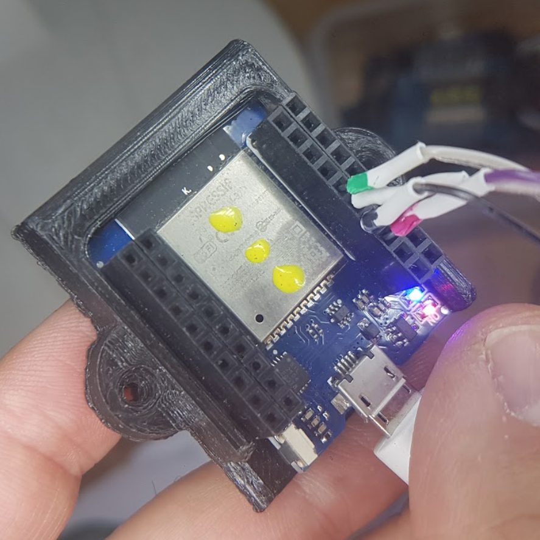
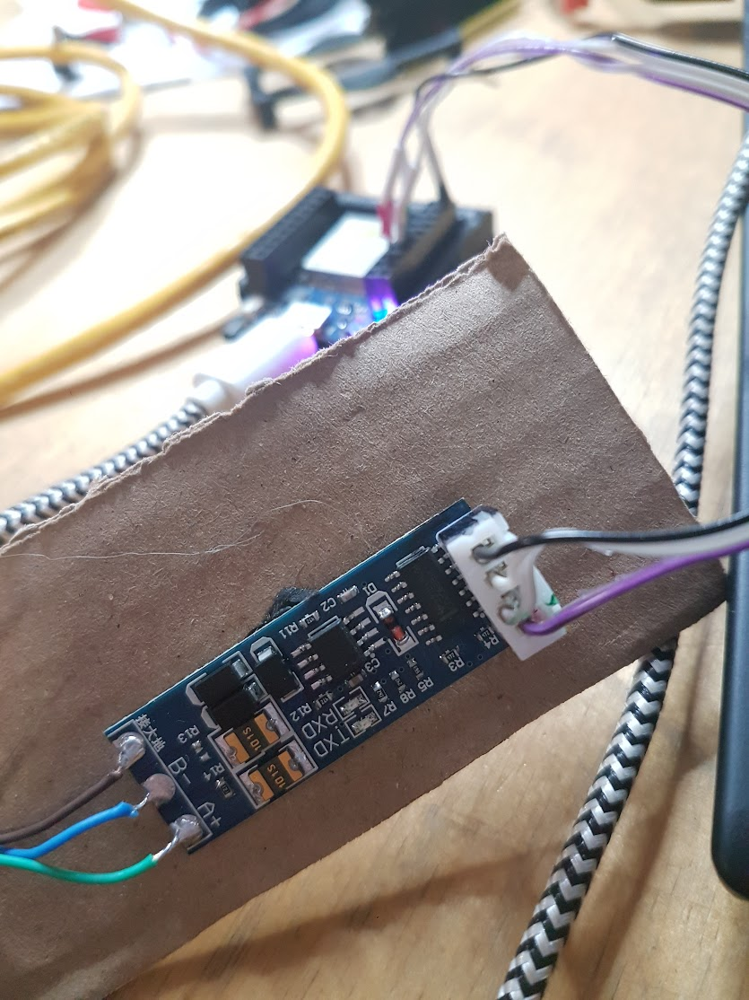
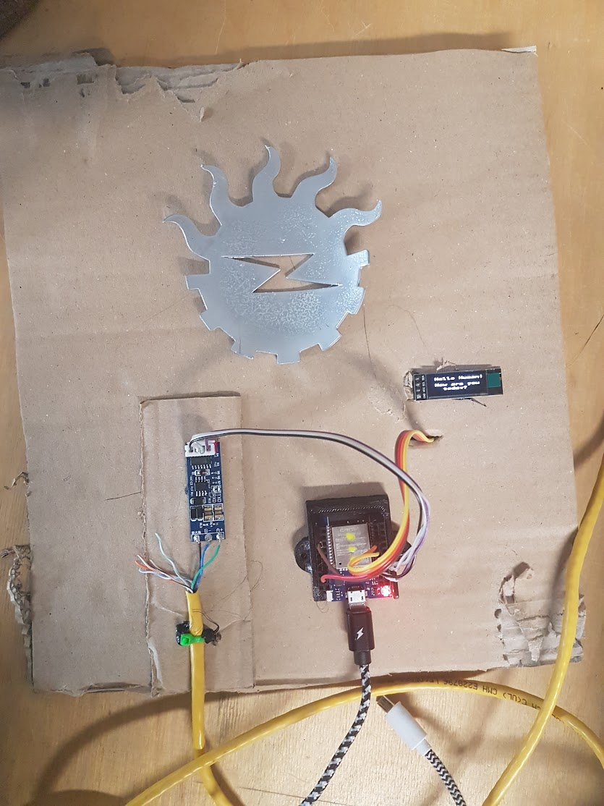
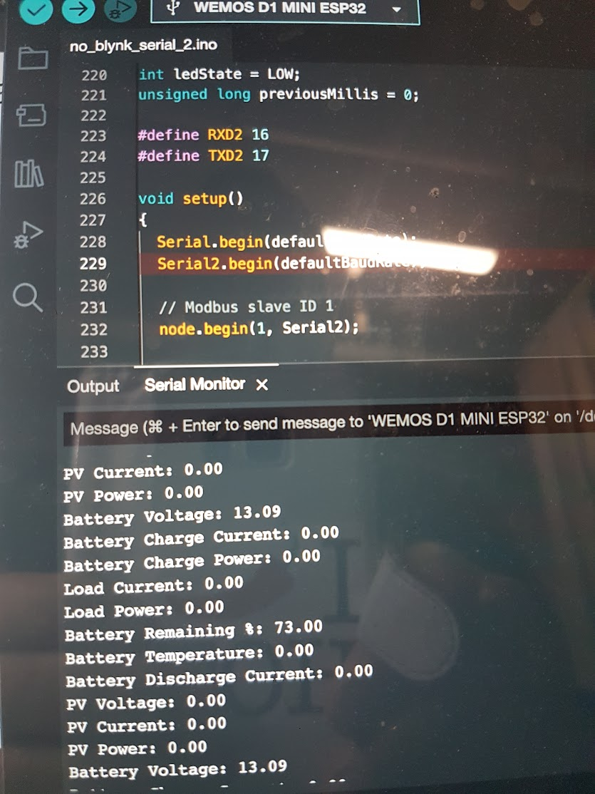
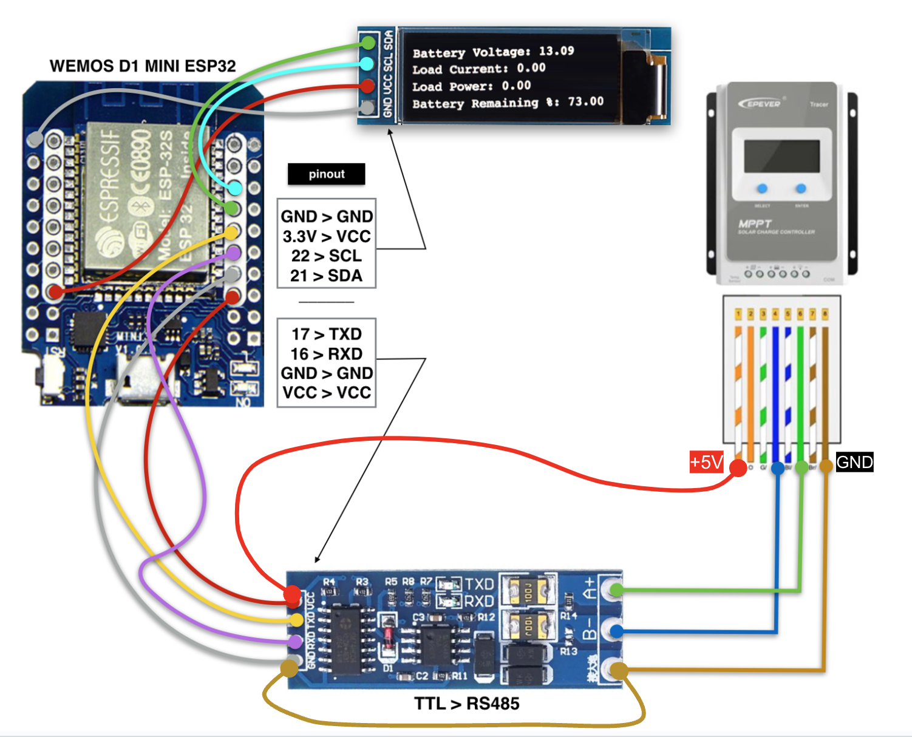

**MPPT WIRELESS MONITORING**

<!-------  BACK   --------->

[ <a href="../README.md#readme-top"> back</a> ]

<table width = 90%>
<tr>
<td align = "justify" width = 90% colspan=2>

This is an ongoing experiment to develop a device that can display and broadcast a number of parameters monitored by the MPPT controller in a Solar Power Unit (SPU) over WiFi and Bluetooth . 
  

  

This is a useful exercise to become more familiar with technologies related to PV (Photovoltaic) and battery storage. The ultimate goal is to optimize the use of the power stored in the battery and managed by the SPU through an intelligent monitoring and distribution of energy in off-grid medium/small living habitats as well as a van or other mobile units.
  

  
Integration with open source home (and IoT) automation solutions, such as Home Assistant and OpenHab, are also in the scope of these experiments. Once the ESP32 is connected and gets real-time data from the MPPT controller, it can feed a channel on a MQTT server running in Home asiistant so that any other device connected to the same server (locally or via internet) can subscribe to that channel and operate according to the broadcasted data.
  

 

 
 

 

 

 

 

ESP32 powered by EPEVER ethernet

 
 

</tr>

</table>
 
 <!-------  BACK   --------->

[ <a href="../README.md#readme-top"> back</a> ]

