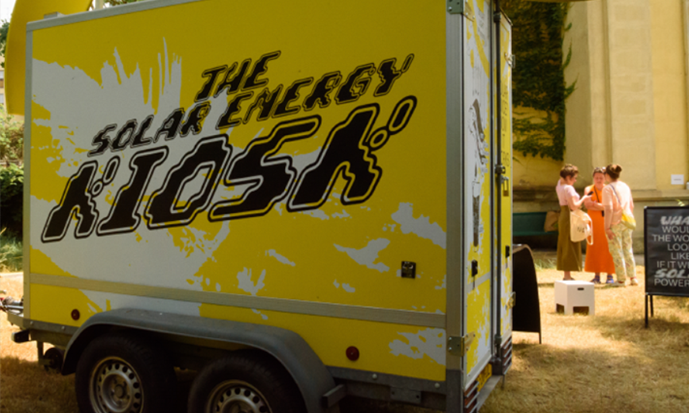

## SOLARPUNK LAB

<!-- PROJECT LOGO -->

official git / repo
 

 

 

<!-- TABLE OF CONTENTS -->

  
CONTENTS

  <ul>
    <li><a href="#about">About Solarpunk Lab</a></li>
    <li><a href="#actions">Events / Actions</a>
    <ul>
    	<li><a href="TES/tes.md">SPL @ "The Energy Show"</a></li>
    	<li><a href="SDL/SDL.md">Solarpunk Design Lab / BKK</a></li>
    	<li><a href="HNI/hni.md">Solar Monsters / HNI</a></li>
    	<li><a href="WU/wu.md">SPL @ "Warming Up"</a></li>
    	<li><a href="SPLAT/splatg.md">SPLAT @ A Gráfica / Setúbal</a><li>
    	    	<li><a href="SPLEE/splee.md">SPLEE workshop @ ANIMAIS / Lisbon</a></li>
    </ul>
    </li>      
    <li><a href="#diy">DIY projects and experiments</a>
    <ul>
    <li><a href="SPLAT/splat.md">SPLAT Ecosystem</a></li>
    <li><a href="docu/SOLARPUNKBOTS.pdf" target="new">SOLARPUNKBOTS</a></li>
    <li><a href="BOKASHI/bokashi.md">Solar Monsters / HNI</a></li>
    <li><a href="UVC/uvc.md">UV-C LIGHT BLEACHING</a></li>
    <li><a href="GG/gg.md">SPL GUERRILLA GARDENING</a></li>    
    <li><a href="MFC/mfc.md">MFC BIOREACTOR</a></li> 
    <li><a href="MPPT/mppt.md">MPPT MONITORING</a></li> 
    </ul>
    </li>
	 <li><a href="#3D">3D STL models</a> </li>
	 <li><a href="code/">Code</a> </li>
	 <li><a href="#contact/">Contact</a> </li>
	 
  </ul>

 
 
<table width=100% bordercolor=#000>
<tr>
<td align="center" colspan=2>

</tr>
</table>

## ABOUT SOLARPUNK LAB

SOLARPUNK LAB IS A PROJECT AIMED AT PROMOTING THE PRACTICAL SIDE OF SOLARPUNK PHILOSOPHY, 
EXPLORING AND EXPERIMENTING METHODS THAT ENABLE CITIZENS TO SOCIAL AND 
SUSTAINABLE RESISTANCE, AGAINST AN EVER GROWING SENSE OF DYSTOPIAN 
IMPOTENCE, AGONIZING CAPITALISM AND ECOLOGICAL CATASTROPHE.
  
IN THESE UNCERTAIN TIMES OF EXTREME GEOPOLITICAL INSTABILITY, ENERGY AND 
ENVIRONMENTAL CRISIS AND SOCIAL INEQUALITY WE ARE LOOKING AT OPTIONS FOR NOT JUST SURVIVING WITH HUMAN DIGNITY BUT FOR CATCHING THE CHANCE OF A 
RADICAL SHIFT IN THINKING AND MAKING. WE BELIEVE THAT THIS SHIFT WILL BRING OUR SOCIETIES TO A NEW LEVEL OF GLOBAL CONSCIOUSNESS WHERE THE RESPECT OF THE “NATURAL” ORDER OF THINGS WILL SPONTANEOUSLY LEAD TO A UNITY OF SOULS, WHERE DIFFERENCES BECOME A PRIMARY SOURCE OF HEALTH AND WEALTH.
  
WE CONCEIVE SOLARPUNK, ORIGINALLY BORN AS A FICTIONAL LITERARY GENRE WITH A STRONG “POSITIVE” PERSPECTIVE ON THE FUTURE OF HUMANITY (IN THIS AND 
EXTRA-PLANETARY WORLDS) AS A SEAMLESS CONTAINER OF IDEAS AND PROJECTS THAT CAN FULFILL ITS ORIGINAL VISION ADOPTING A SET OF FLUID STRATEGIES WITH A STRONG AND DIRECT IMPACT.
  
THESE STRATEGIES ARE LARGELY BASED ON DIY (DO IT YOURSELF) AND DIT (DO IT TOGETHER) ACTIONS THAT AFFIRM EQUALITY, PROMOTE DIVERSITY AND REINFORCE 
CONNECTIONS BETWEEN INDIVIDUALS, COMMUNITIES AND NATURE. SUCH ACTIONS ARE CHARACTERISED BY THE INTELLIGENT AND RESPECTFUL USE OF RENEWABLE 
ENERGIES AND THE CONVERGENCE OF EPHEMERAL TECHNOLOGIES (DIGITAL/ELECTRONIC) AND ANCIENT WISDOM IN ARTISANRY, BUILDING AND FARMING, TO INSPIRE INFINITE POSSIBILITIES OF ECO-LOGICAL CREATIONS AND OFF-GRID LIFESTYLES.
  
SERIES OF EVENTS ARE ORGANISED WITH AND BY SOLARPUNK LAB, TO BE HELD AT PERMANENT AND NOMADIC SPACES, AIMED AT EDUCATING, INFORMING AND ENABLING THE GENERAL PUBLIC TO SIMPLE, AFFORDABLE AND PRACTICAL ACTIONS THAT PUT 
TOGETHER RENEWABLE ENERGY SOURCES (SOLAR, EOLIC, GEOTHERMAL), PHYSICAL 
COMPUTING, DIGITAL FABRICATION, ECO-PASSIVE AND MORPHO-ECO-LOGICAL
ARCHITECTURE, NATURAL AND ARTIFICIAL PHOTOSYNTHESIS, BACTERIAL 
FERMENTATION, MYCELIUM CULTURING AND OTHER INTERDISCIPLINARY PRACTICES TO RE-INVENT THE PRESENT AND RE-DESIGN THE FUTURE.
  
SOLARPUNK LAB ACTIONS AND CONTRAPTIONS,  INFUSED WITH INTERDISPLINARY EXPERIMENTS, WILL BE DIFFUSED THROUGH OPEN SOURCE CHANNELS AND PERFORMED / DISPLAYED AT PUBLIC INSTALLATIONS AND GROUP RITUALS. OUR WISH IS TO AWAKEN A SENSE OF OPEN AND ACTIVE PARTICIPATION SO THAT THE SCOPE OF THE LAB ITSELF GETS CRITICALLY REDEFINED AT EACH STEP, ESCAPING LABELS AND CONCEPTUAL BOUNDARIES.

<table width=100% bordercolor=#000>
<tr>
<td width=50% align="center">

<td width=50% align="center">

</tr>
<tr>
<td width=50% align="center">

<td width=50% align="center">

</tr>

</table>

<!-------  BACK   --------->

[ <a href="#readme-top"> back</a> ]

## SPL EVENTS / ACTIONS

 

<table>
<tr>
<td align = "center" width = 50% >
<a href="SDL/SDL.md">

  Solarpunk Design Lab </a>
</td>
<td align = "center" width = 50% >
<a href="TES/tes.md">

  SPL @ "The Energy Show" </a>
</td>

<tr>
<td align = "center" width = 45% >
<a href="HNI/hni.md">

  Solar Monsters @ HNI </a>
</td>
<td align = "center" width = 45% >
<a href="WU/wu.md">

  SPL @ "Warming Up" </a>
</td>

<tr>
<td align = "center" width = 45% >
<a href="SPLAT/splatg.md">

  SPLAT @ A Gráfica</a>
</td>
<td align = "center" width = 45% >
<a href="SPLEE/splee.md">

  SPLEE workshop @ ANIMAIS </a>
</td>

</tr>

</table>

<!-------  BACK   --------->

[ <a href="#readme-top"> back</a> ]

## DIY PROJECTS AND EXPERIMENTS

 

 
 
  
  
 
 
  
  
  <a href="GG/gg.md"><a>
 
  
 
 
  
  

## 3D STL MODELS

<ul>
<li> BOKASHI  </li>
<li> SPLAT parts</li>

</ul>

[ <a href="#readme-top"> back</a> ]

## CONTACT

<a href="mailto:tez@solarpunklab.org">tez@solarpunklab.org
  
</a>

