**SOLARPUNK DESIGN LAB - BANGKOK**

<!-------  BACK   --------->

[ <a href="../README.md#readme-top"> back</a> ]

<table width = 90%>
<tr>
<td align = "justify" width = 90% colspan=2>
 

ONLINE COURSE, HELD BY TEZ AT COMMDE (DEPARTMENT OF INDUSTRIAL DESIGN, FACULTY OF ARCHITECTURE, CHULALONGKORN UNIVERSITY OF BANGKOK) FROM MAY 23RD TO 26TH, 2022.

THIS 4-DAYS ONLINE WORKSHOP WAS AIMED AT EXAMINING THE ROOTS AND THE CURRENT STATUS OF THE SOLARPUNK MOVEMENT, THE MANIFOLD OF COMPONENTS THAT FORMS ITS FLUID CONTAINER OF IDEAS AND PRACTICES, AND A SET OF HANDS-ON ACTIONS TO HELP EMBRACE AN ECO-ACTIVIST AND ANTI-DOOMERISM FUTURE.  
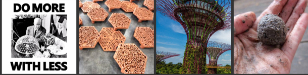
  
<tr>
<td align = "justify" width = 90% colspan=2>

THE WORKSHOP COVERED A VAST VARIETY OF INTERCONNECTED TOPICS, RANGING FROM DOOMERISM CULTURE, *PUNK LITERATURE, ECO-REBELLION, NO-MANIFESTO, ECOTOPIA, BUCKMINSTER FULLER, SOLARPUNK AESTHETICS, SOLARPUNK BLOGGING, RENEWABLE ENERGY MYTHS AND FACTS, TO GUERRILLA GARDENING, PERMACULTURE, TERRACOTTA AND BAMBOO COOLING, ECO-PASSIVE ARCHITECTURE, EARTHSHIPS, OFF-GRID LIVING, SOLAR COOKING, SOLAR PRINTING, SOLAR MARKETING, GREENWASHING, FERMENTATION, BIOREACTORS, VERTICAL FARMING, SCUTTLEBUTT NETWORK, SOLARTRONICS, REC/REP (RECYCLE, REPAIR, REPURPOSE) AND LUNARPUNK.
  
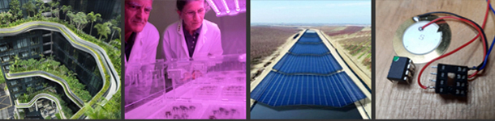
<tr>
<td align = "justify" width = 90% colspan=2>

FOUR (ANALOG) PRACTICAL ASSIGNMENTS WERE GIVEN FOR THIS COURSE:

<ol>
<li> RE_GROW YOUR VEGGIE GROCERY

<li> GUERRILLA GARDENING (WITH DIY SEED SPREADER AND SEED BOMBS)

<li> SOLAR COOKING (WITH DIY SOLAR OVEN)

<li> REC/REP: CREATE NEW USEFUL OBJECT(S) DOING RECYCLE, REPAIR, REPURPOSE
  
</ul>
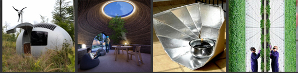
</tr>

<tr>
<td align = "justify" width = 90% colspan=2>
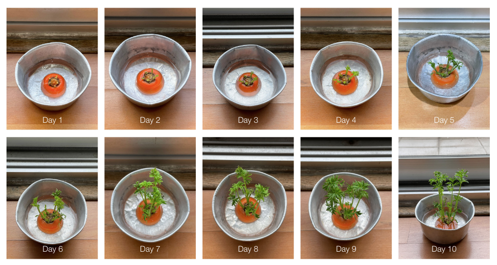
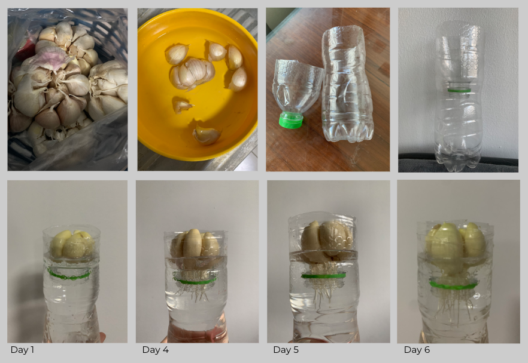
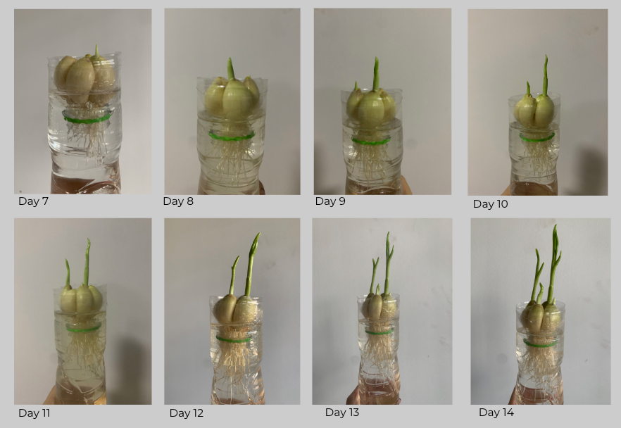
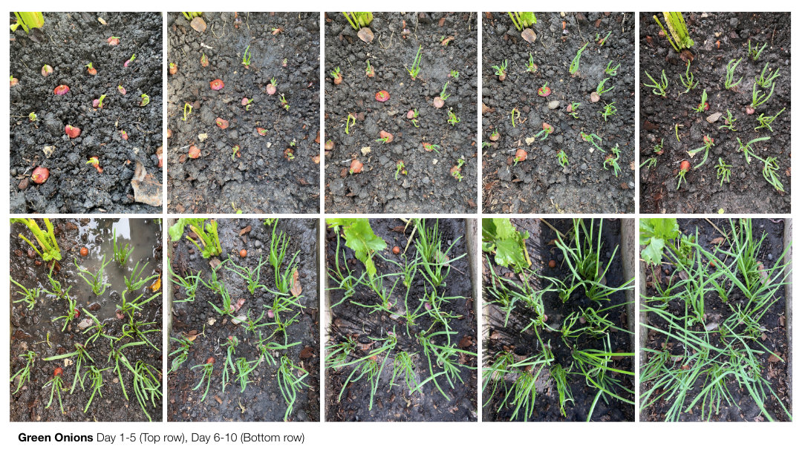
</tr>

<tr>
<td align = "justify" width = 90% colspan=2>
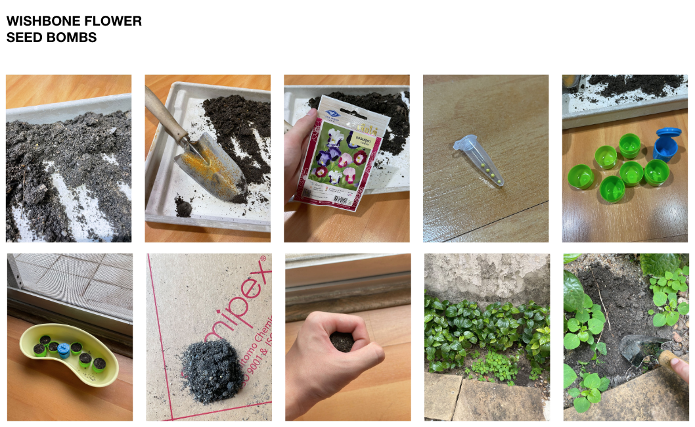
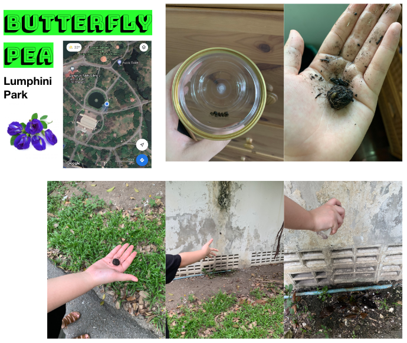
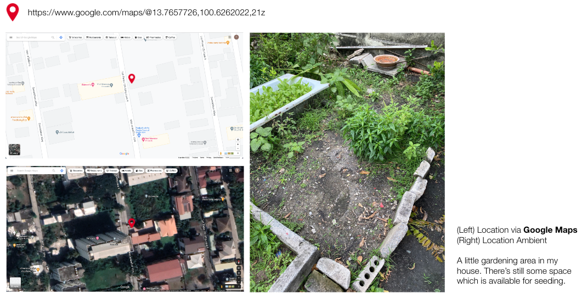
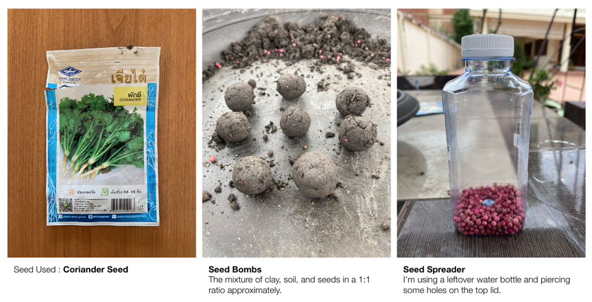
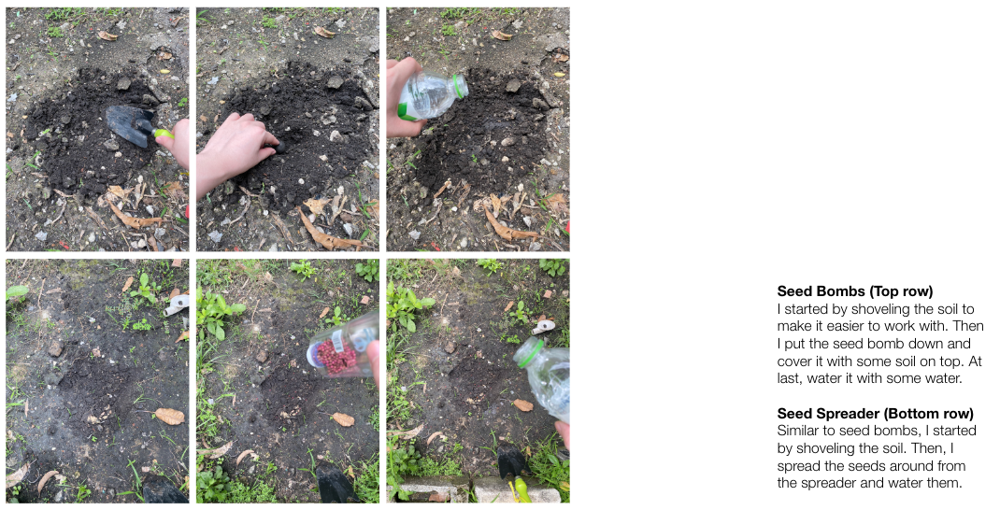
</tr>

<tr>
<td align = "justify" width = 90% colspan=2>
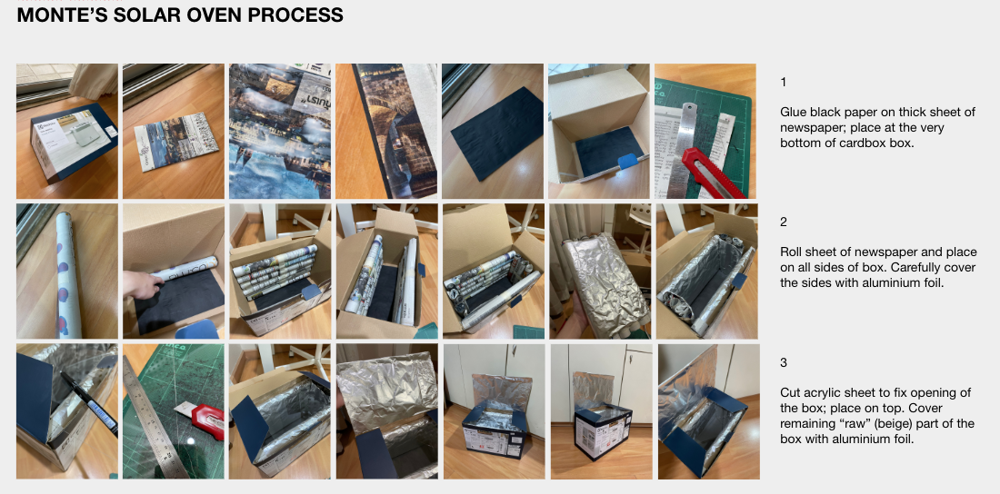
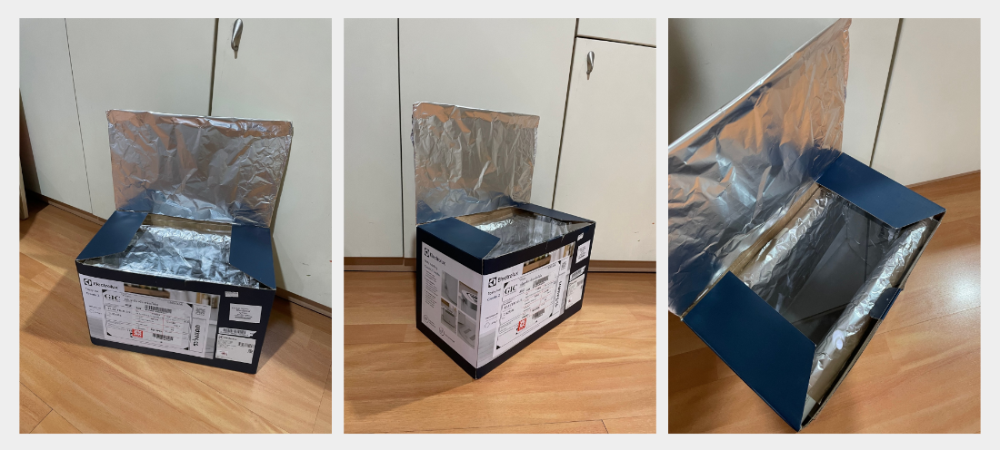
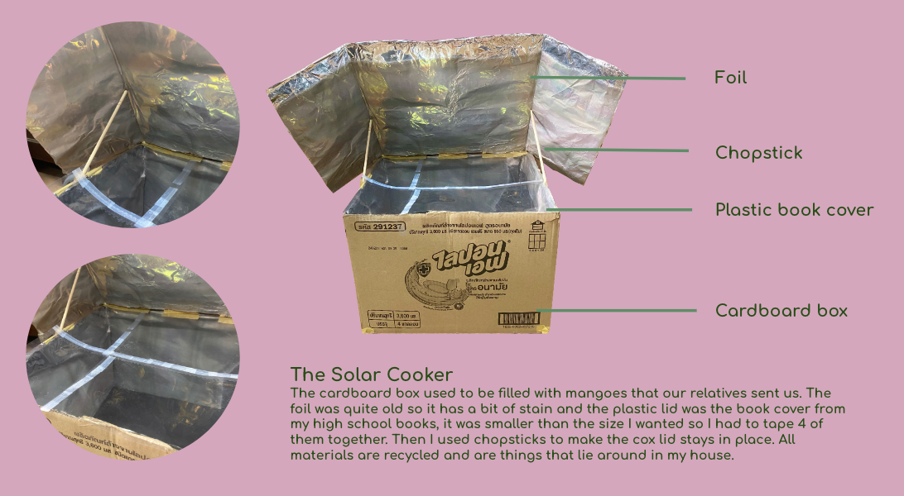
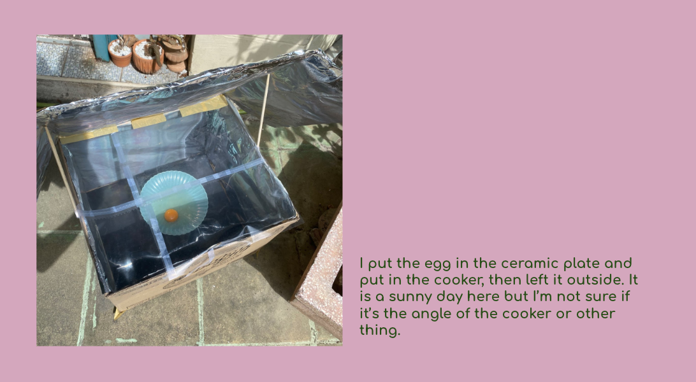
</tr>

<tr>
<td align = "justify" width = 90% colspan=2>
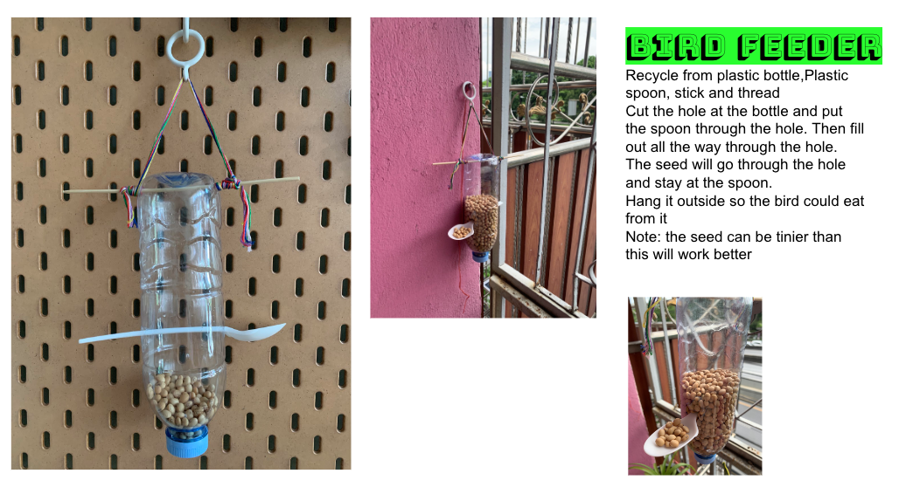
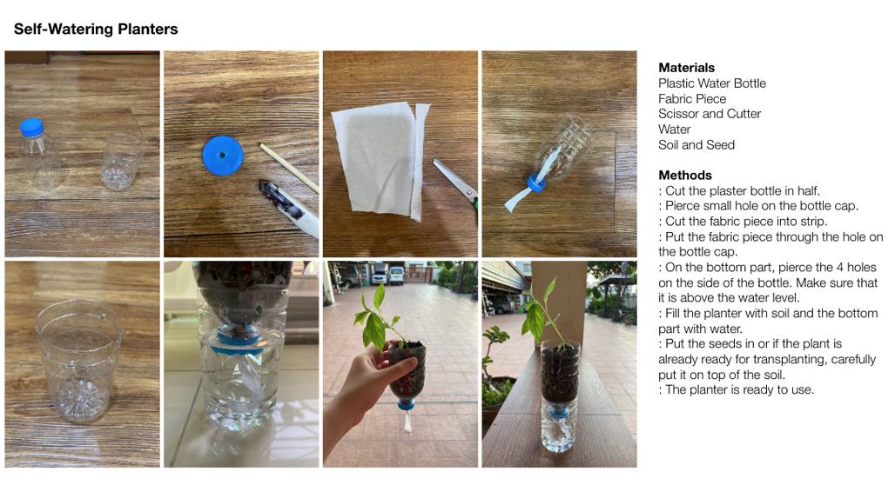
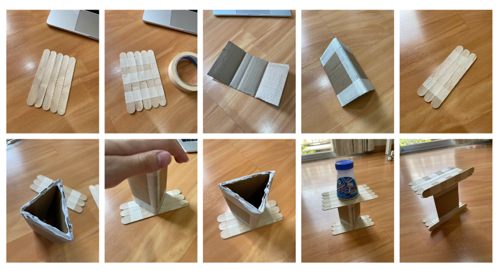
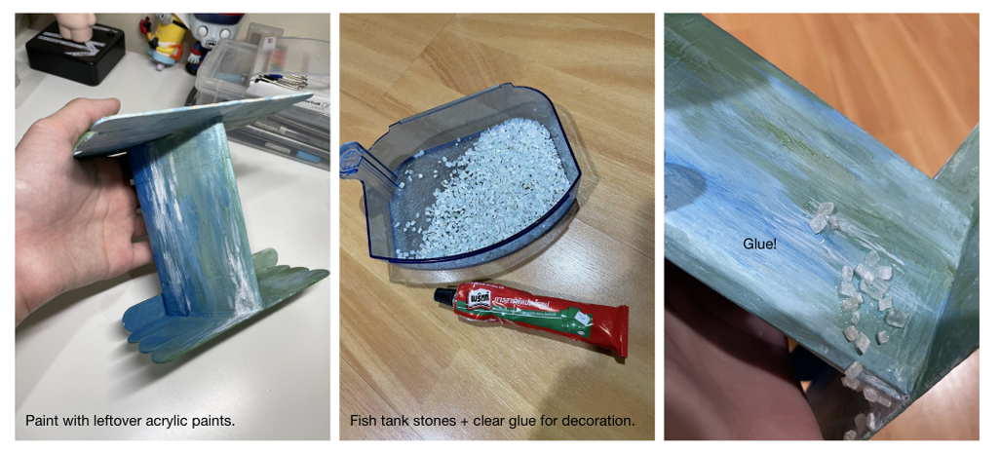
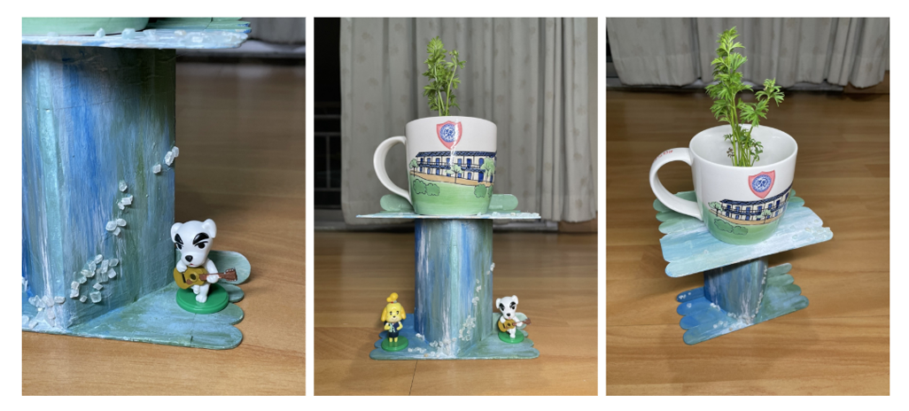

</tr>

</table>

<!-------  BACK   --------->

[ <a href="../README.md#readme-top"> back</a> ]

