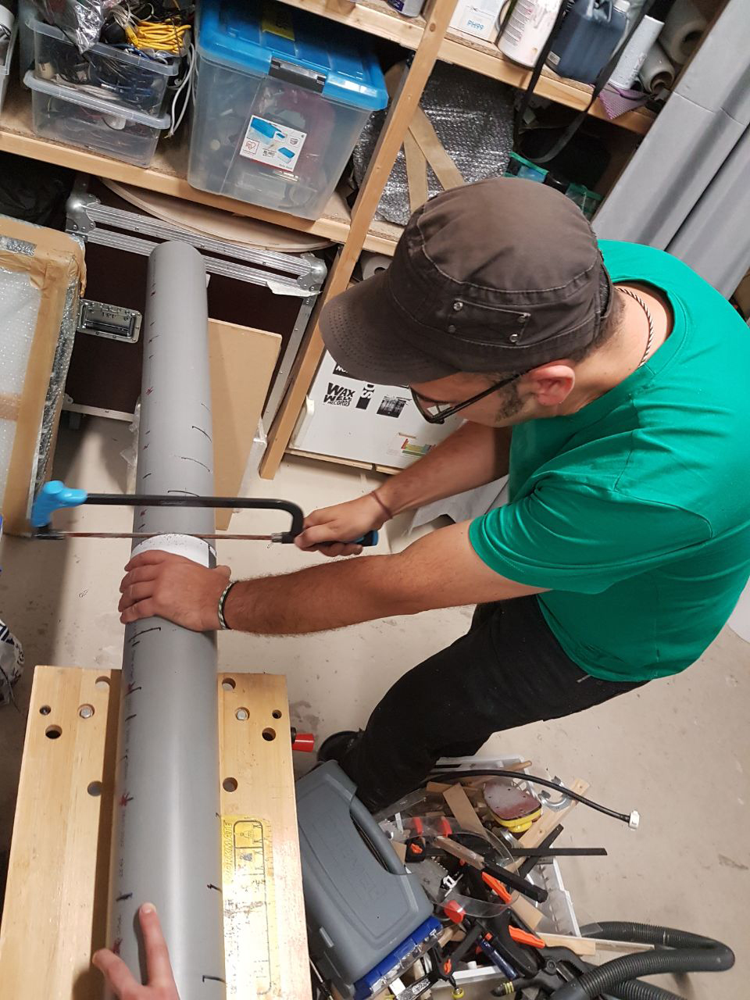
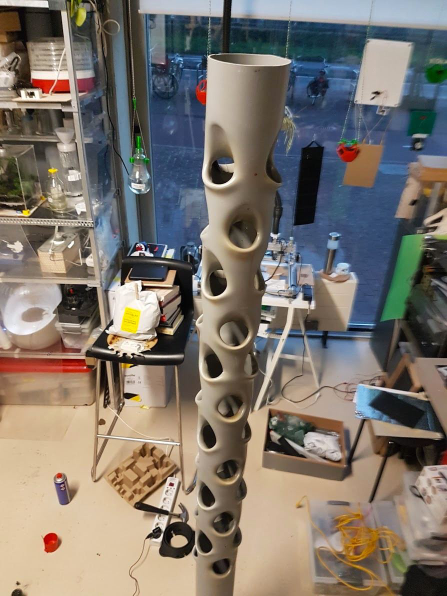
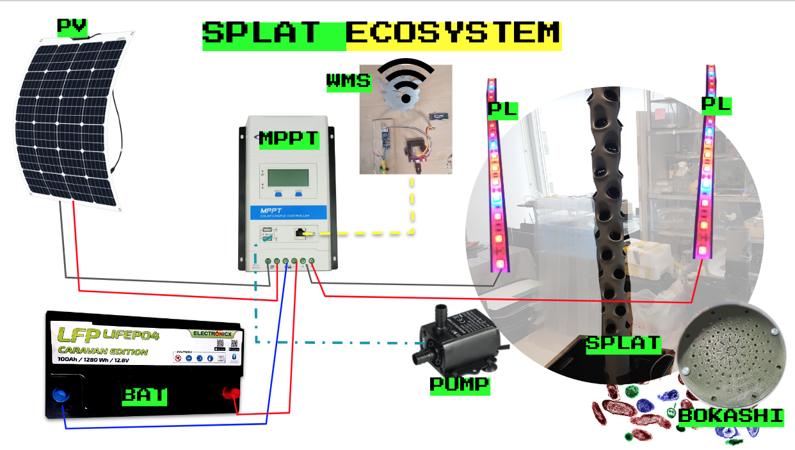
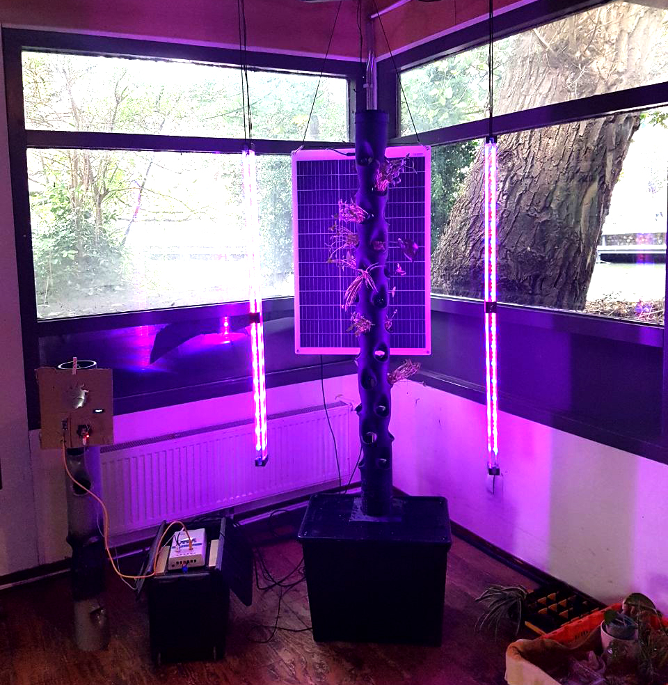
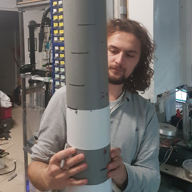
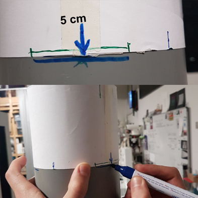
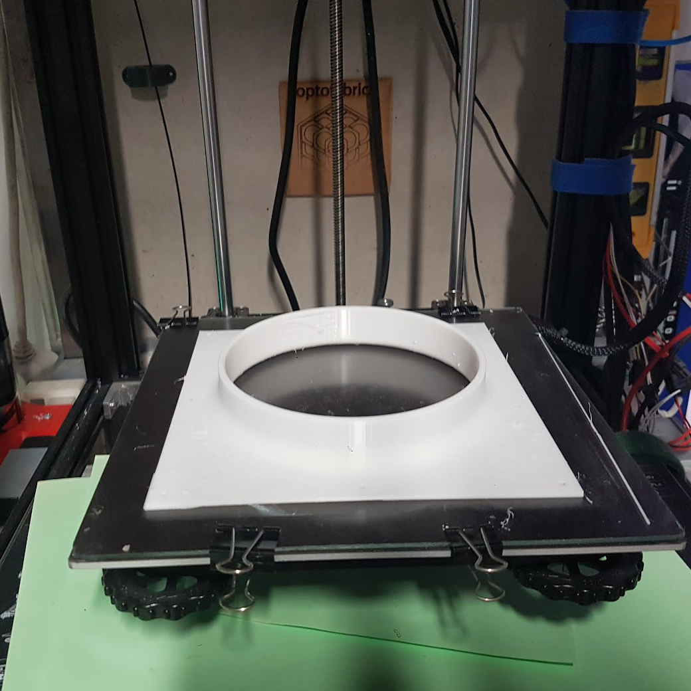
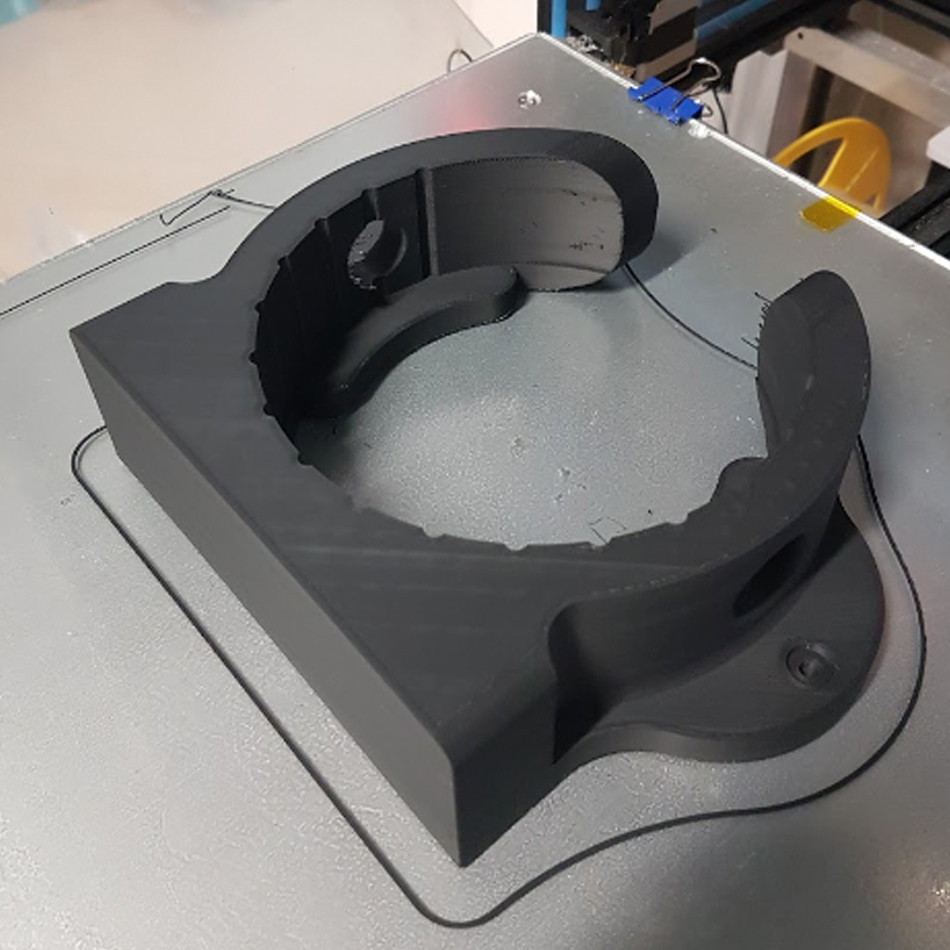
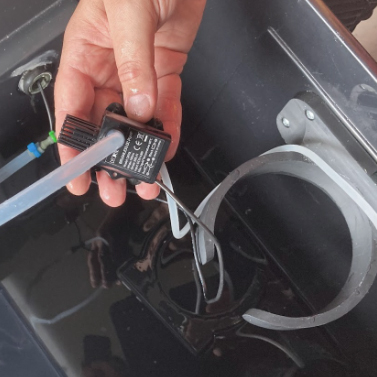
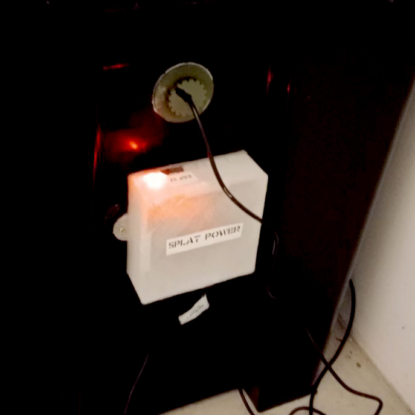

**SPLAT [Solarpunk Lab Aeroponics Tower]  ECOSYSTEM**

<!-------  BACK   --------->

[ <a href="../README.md#readme-top"> back</a> ]

<table width = 90%>
<tr>
<td align = "justify" width = 90% colspan=2>
Aeroponics is the practice of growing plants in an air or mist environment without the use of any substrate. The plant roots are suspended in the air and are misted or sprayed periodically with a nutrient solution or aerosol of nutrient solution. The biggest advantage of aeroponics is that roots are exposed to air, thus there is never an issue of insufficient oxygen. The biggest disadvantage of such system is the commercial price, hence a DIY solution is a must-do.
  
SPLAT adopts a technique for molding standard 125mm diameter PVC pipes, ordinarily used for sewage infrastructure, to make it hold a large number of plants in a vertical gardening fashion. This technique was inspired and informed by various tutorial videos of DIY aeroponics towers such as <a href="https://www.youtube.com/watch?v=arNVaP5XNEg" target="new">this one</a>.
  

<tr>
<tr>
<td align = "justify" width = 50%>

<td align = "justify" width =50%> 

 
</tr>

<tr>
<td align = "justify" colspan=2>
Our take on this project was to try and create a circular system that would use solar energy for powering the water pump, and home-made compost (<a href="../BOKASHI/bokashi.md" target="new">bokashi</a>) for the necessary nutrients to add to the water that is being sprinkled onto the plants' roots.
  
This system could work outdoor with natural sunlight or indoor with specific lighting that would support the necessary photosynthesis. These lights will also be powered by an off-grid rechargable solar power unit, comprising of a LIPO battery, a solar panel and a MPPT charge controller, monitored with a custom wireless diy device. 
  

A fairly high degree of autonomy is then granted to the system.
  
</tr>

<tr>
<td align = "justify" width = 90% colspan=2>

</tr>

<tr>
<td align = "justify" width = 50%>

<td align = "justify" width =50%> 
 
</tr>

<tr>
<td align = "justify" width = 90% colspan=2>
5cm lines were cut at regular vertical intervals of approx 15cm so that an optimal number of holes could be molded for hosting the aeroponics pots.
A glass bottle (from tomato sauce passata) was used to enlarge and shape the holes after being "softened" with an hot-air gun.  
</tr>

<tr>
<td align = "justify" width = 50%>

<td align = "justify" width =50%> 

 
</tr>

<tr>
<td align = "justify" width = 90% colspan=2>
We've also designed 3D-printed parts to help the fixing of the PVC molded pipe to a box and to equalize the water sprinkling to the plants' roots. 
We've used Dremmel and drilling tools to cut holes where some of the 3D-printed parts had to fit. 
</tr>

<tr>
<td align = "justify" width = 50%>

<td align = "justify" width =50%> 
 
</tr>

<tr>
<td align = "center" colspan=2> 

</tr>

<tr>
<td align = "center" colspan=2> 
All STL files of our 3D models are available <a href="../3D/SPLAT-AEROPONIC-TOWER">here</a>. 
</tr>

<tr>
<td align = "justify" width = 50%>

<td align = "justify" width =50%> 
 
</tr>

<tr>
<td align = "justify" colspan=2> 
Finally, the water with nutrients is pumped up to from the bottom of the box the top of the tower with a usb-powered 5v pump, timed with an ESP32 controller to regulate the sprinkling at custom intervals.
</tr>

</table>
 
 <!-------  BACK   --------->

[ <a href="../README.md#readme-top"> back</a> ]
