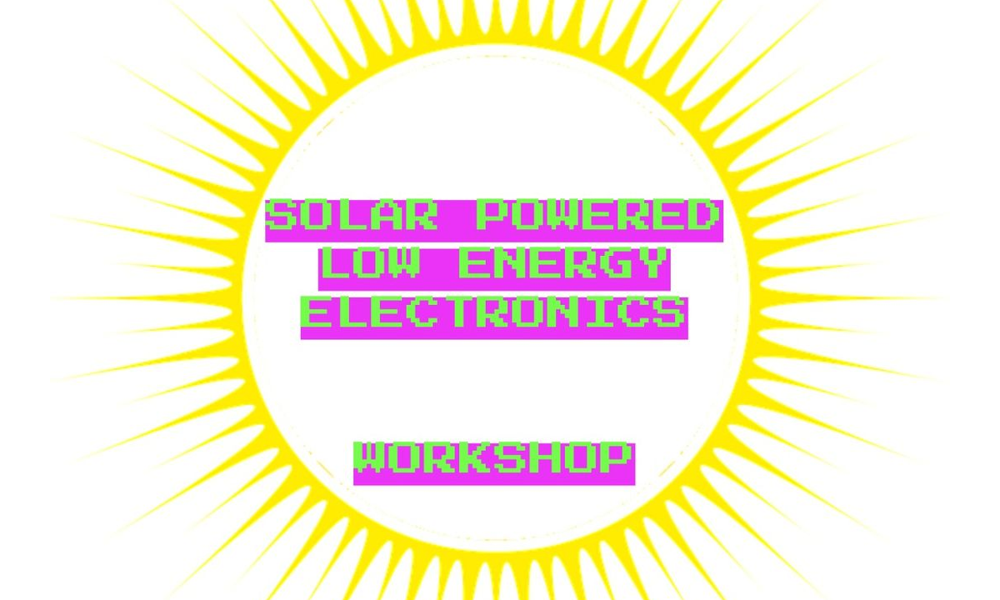
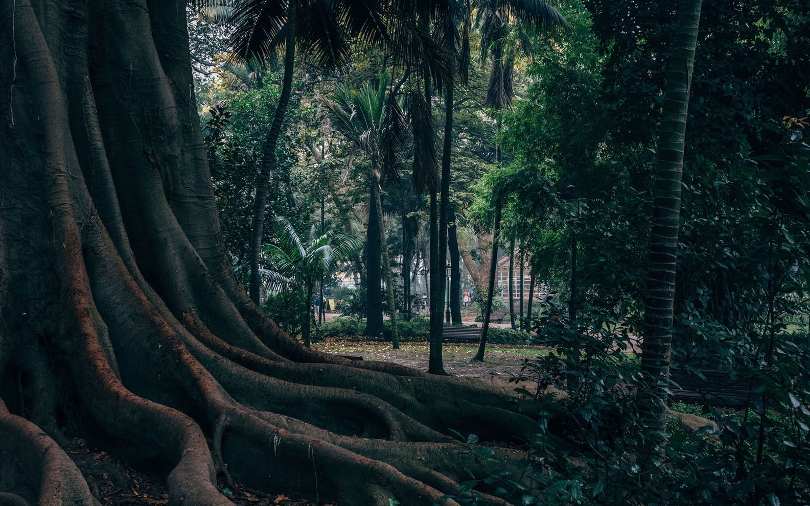
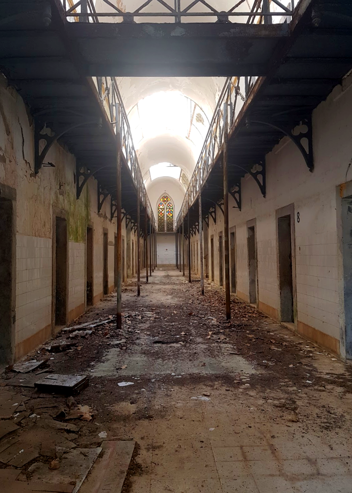
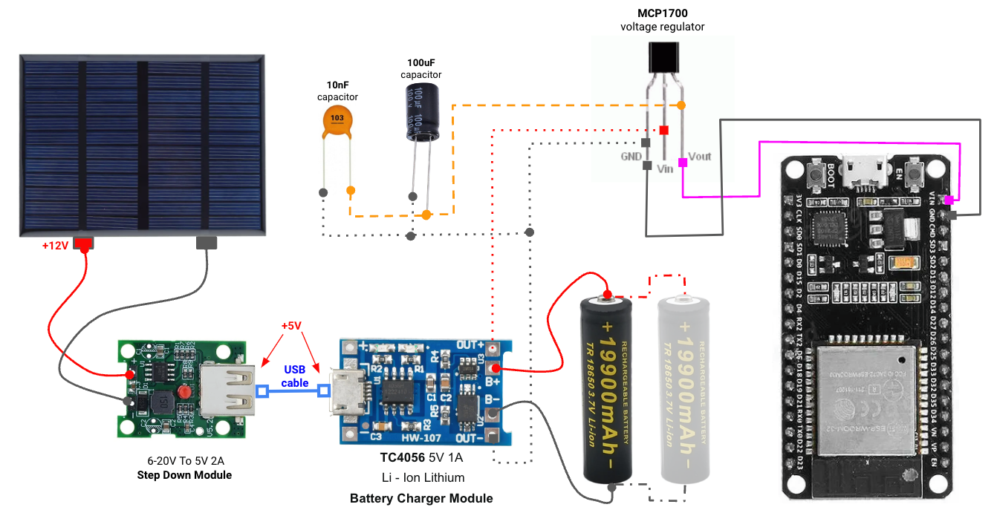
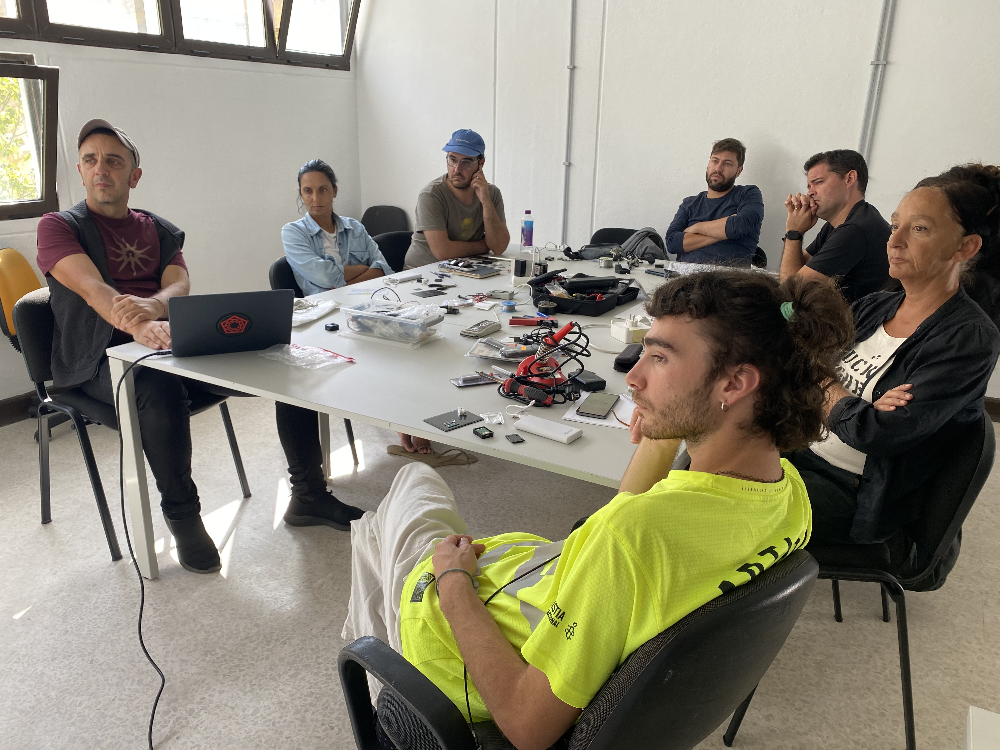
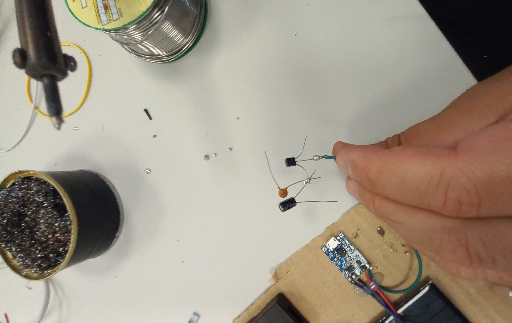
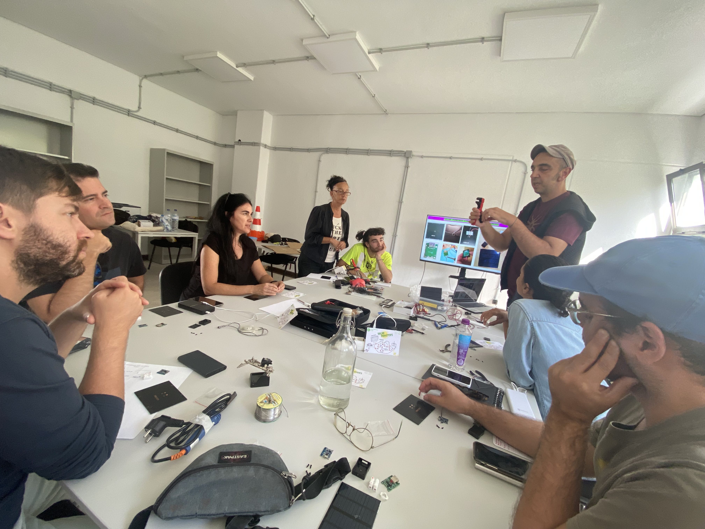
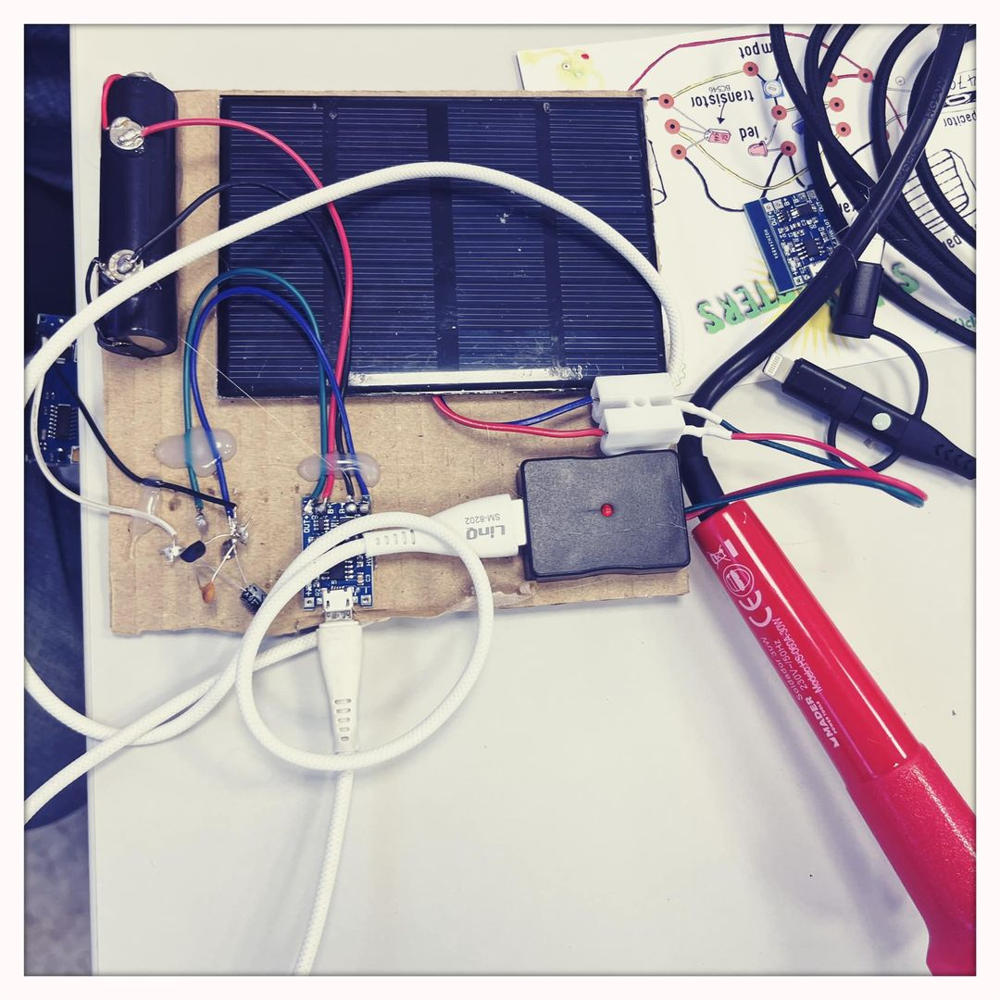
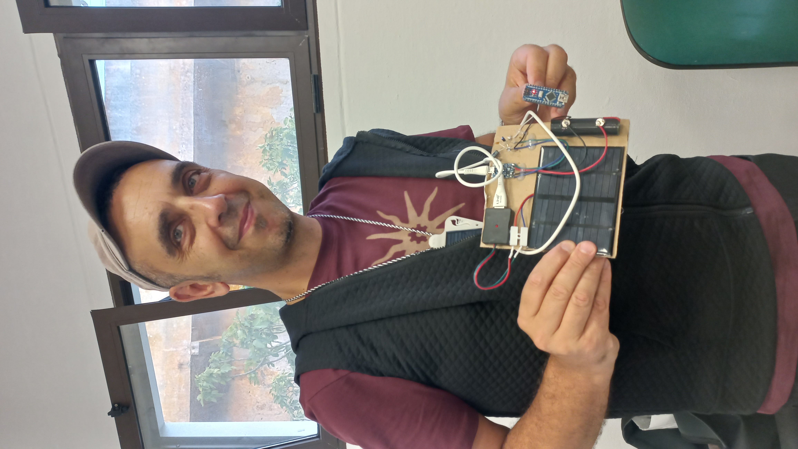
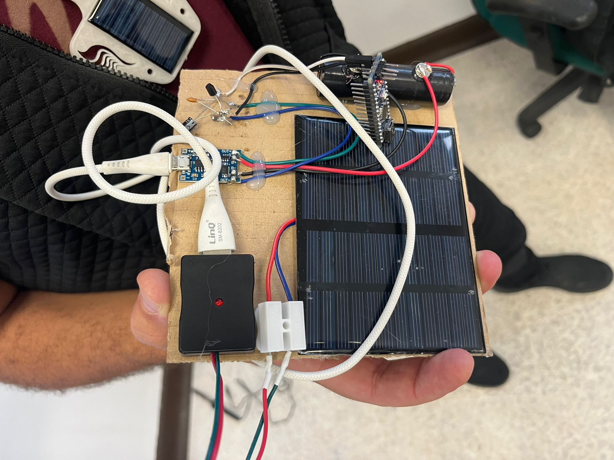

**SPLEE WORKSHOP @ ANIMAIS / Lisbon**

<!-------  BACK   --------->

[ <a href="../README.md#readme-top"> back</a> ]

<table width = 90%>
<tr>
<td align = "justify" width = 90% colspan=2>

   
Solarpunk Lab contributed to the artistic residency "ANIMAIS" - organised by <a href="https://www.cada1.net/works/open-call-animais-residencia-artistica-novos-media/" target ="new">CADA</A> in Lisbon (PT) - with the new workshop "SPLEE" and an overview and considerations on the Solarpunk movement and practical philosophy by TeZ. 
   

ANIMAIS starts from the premise that thinking in terms of hybrids, “nature-cultures” and multi-species tangles offers an opportunity to creatively re-elaborate the frontiers of a shared world that, for the good of the planet, urgently requires new ways of perception and action. 
 
Despite decades of thinking to recombine culture and nature, this residence recognizes that resisting this binarism can be more difficult than we think, that we may not have the linguistic and cultural resources to express our understanding of non-human environments in more inclusive and holistic.
 
Two locations, one rural, the other almost urban, combine to function as a space and a means to explore the complex and dynamic interactions between human beings, technologies and nature; a space for the emergence of new beginnings, open processes and new forms of production.
 

 </tr>
  
<tr>
<td align = "justify" width = 50% colspan=1>

<td align = "justify" width = 50% colspan=1 >

 </tr>
 <tr>
<td align = "justify" width = 50% colspan=2>

<tr>
<td align = "justify" width = 90% colspan=2>

SPLEE (Solar Powered Low Energy Electronics) is a “hands-on” workshop, exploring different techniques to energise low-power electronic devices with a portable solar panel setup.  Participants are invited to bring a portable USB power bank (like the ones used for mobile phones etc.) and their own low-power electronics (arduino, sensors, actuators, led lights, etc.). 
 
The goal is to create a small and affordable autonmous system capable to power and recharge itself with solar energy. New creative solutions are encouraged at each session.
  

  

<tr>
<td align = "justify" width = 90% colspan=2>

<tr>
<td align = "left" width = 90% colspan=2>

At the end of the workshop, each participant brings home a complete little system, assembled on recycled cardboard, and usable for powering mobile phones, tablets or custom devices and circuits such as a simple weather station or other portable sensor/actuator assembly, rechargable via a solar cell/panel.
  

  
<a href="https://www.cada1.net/works/open-call-animais-residencia-artistica-novos-media/" target ="new">ANIMAIS</a>
  

</tr>
</table>

<!-------  BACK   --------->

[ <a href="../README.md#readme-top"> back</a> ]
