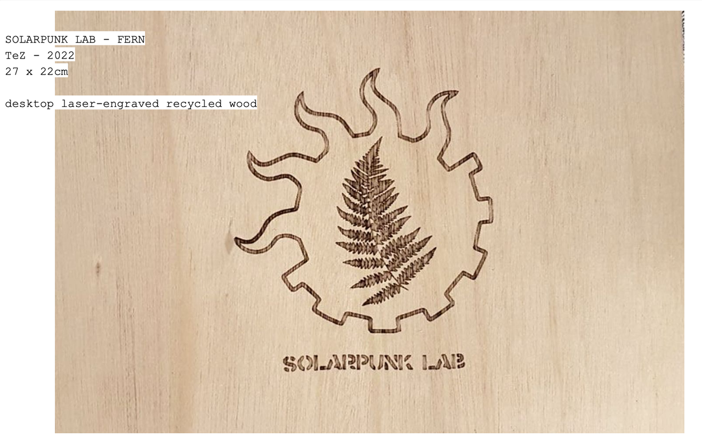

**SPL @ THE ENERGY SHOW**

<!-------  BACK   --------->

[ <a href="../README.md#readme-top"> back</a> ]

<table width = 90%>
<tr>
<td align = "justify" width = 90% colspan=2>
Solarpunk Lab contributed to the exhibition "The Energy Show" with some solar-powered and repurposed art*facts produced by TeZ in 2022. 
 
  

<tr>
<td align = "left" width = 90% colspan=2>
 

How much energy do we have and need today? This question opens The Energy Show – Sun, Solar and Human Power, an exhibition that can be seen from 3 September 2022 through 5 March 2023 at Het Nieuwe Instituut in Rotterdam. The exhibition, put together by curator and designer Matylda Krzykowski and in collaboration with The Solar Biennale, revolves around the sun and its design possibilities. It reflects on visitors’ personal energy levels, features dozens of examples of innovative solar technology, and poses the key question: what would the world look like if it ran on solar energy? 

  
<a href="https://energyshow.hetnieuweinstituut.nl/en/activities/energy-show" target ="new">The Energy Show</a>
  

</tr>
</table>

<!-------  BACK   --------->

[ <a href="../README.md#readme-top"> back</a> ]
