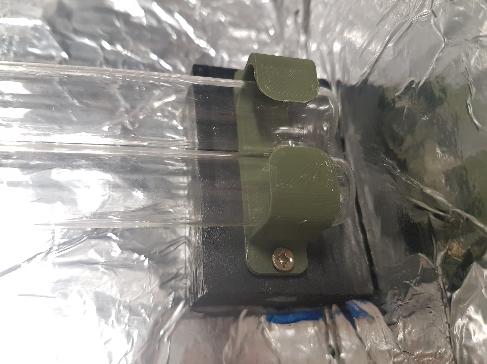

**UV-C SOLAR BLEACHING**

<!-------  BACK   --------->

[ <a href="../README.md#readme-top"> back</a> ]

<table width = 90%>
<tr>
<td align = "justify" width = 90% colspan=2>
UVC light is a radiation method that makes use of a specific wavelength of ultraviolet light to neutralize microorganisms. UV-C light is germicidal, which means it deactivates the DNA of microorganisms like bacteria, viruses, and other pathogens, disrupting their ability to multiply and cause disease. There are three categories of ultraviolet light wavelengths, UVA, UVB, and UVC. UV-C wavelengths are between 200 and 300 nanometers; this short wavelength carries the amount of energy necessary to inactivate microorganisms.
  

  
We have become more familiar with this technology during COVID-19 pandemics for the massive adoption of disinfection devices using UV-C to neautralize the virus.  
 
One "fortunate" effect of this light radiation on natural fibers after a longer period of exposure is that of "bleaching". That is the discoloration of fabric (or other organic fibers) in the areas that are directly exposed to the UV-C wavelength.
  

  

  

  

  

  

Direct exposure of skin and eyes to UVC radiation from most UVC lamps may cause painful eye injury and burn-like skin reactions. Never look directly at a UVC lamp source, even briefly. Use of glass 

In addition, some UVC lamps generate ozone, which can irritate airways. 

  
The use of protection glasses during the operation of UV-C lamps is strongly recommended.
  

  

The build of a UV-C box for disinfection and/or light bleaching is fairly simple. You'll need a cardboard box, aluminum foil, glue, a UV-C lamp, a PL-L ballast and a PL-L connector.
  

  

  

  

  

  

  

  

  

  

  

  

  

</tr>

</table>
 
 <!-------  BACK   --------->

[ <a href="../README.md#readme-top"> back</a> ]

