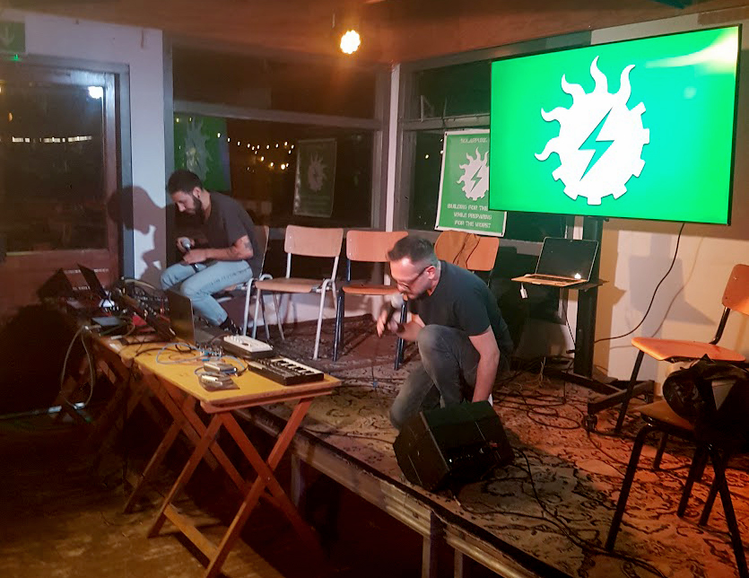

***SPL @ WARMING UP festival***

<!-------  BACK   --------->

[ <a href="../README.md#readme-top"> back</a> ]

<table width = 90%>
<tr>
<td align = "justify" width = 90% colspan=2>
 

  

The first public showcase of Solarpunk Lab was presented at <a href="https://wearewarmingup.nl/" target="new">"WE ARE WARMING UP"</a> International festival, held at and organised by <a href="https://tolhuistuin.nl/" target="new">TOLHUISTUIN</a> in Amsterdam in October 2022, dedicated to eco-activism and interdisciplinary reflections on climate change. The three days program offered an extended overview of the practical actions and experiments conducted by our lab during almost one year of activities and comprising technical and artistic projects, as well as philosophical/political perspectives. Live interventions by <a href="https://www.youtube.com/@Andrewism" target="new">Andrewism</a>, <a href="https://monnik.org/" target="new">Studio Monnik</a>, <a href="https://civicinteractiondesign.com/projects/designing-with-the-sun/" target="new">Angela Mackey and Monse Vallejo</a> complemented the rich DIY showcase presented by TeZ.
  

 

 

 

 

 

 

 

 

 

 

 

</tr>
</table>

<!-------  BACK   --------->

[ <a href="../README.md#readme-top"> back</a> ]
